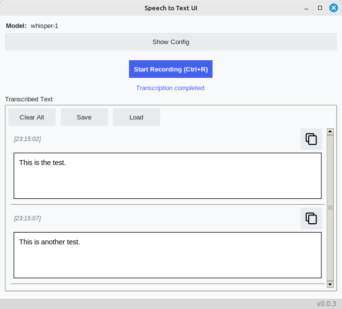
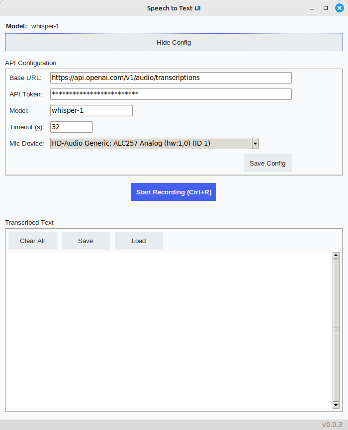

# Speech to Text UI

Speech to Text UI is a simple graphical user interface for recording audio, transcribing it using OpenAI Whisper API, and managing configurations for easy interaction.



## Features

- Configure and save OpenAI API base URL and token.
- Start and stop audio recording.
- Transcribe recorded audio using the Whisper API.
- Display transcriptions in an organized format.
- Copy the most recent transcription to the clipboard.
- Load and save configuration settings in JSON format.

## Requirements

- Python 3.x
- `tkinter`
- `sounddevice`
- `wavio`
- `requests`
- `Pillow`

## Installation

1. Clone the repository:

   ```bash
   git clone https://github.com/constLiakos/STT-UI.git
   cd STT-UI
   ```

2. Install the required packages:

   ```bash
   pip install sounddevice wavio requests pillow
   ```

3. Run the application:

   ```bash
   python main.py
   ```

## Usage

- Enter the OpenAI API Base URL and token in the configuration section.
- Click "Save Config" to save the settings.
- Press the record button to start/stop audio recording.
- Transcriptions will be displayed in the text area upon completion.
- Use the copy button to copy the latest transcription.



## Info 

### API Base URLs

| Provider | API URL | Model Names |
| -------- | ------- | ------------|
| OpenAI | https://api.openai.com/v1/audio/transcriptions | whisper-1 |
| Groq   | https://api.groq.com/openai/v1/audio/transcriptions | whisper-large-v3, whisper-large-v3-turbo, distil-whisper-large-v3-en |

## License

This project is licensed under the Apache License 2.0 - see the [LICENSE](LICENSE) file for details.
